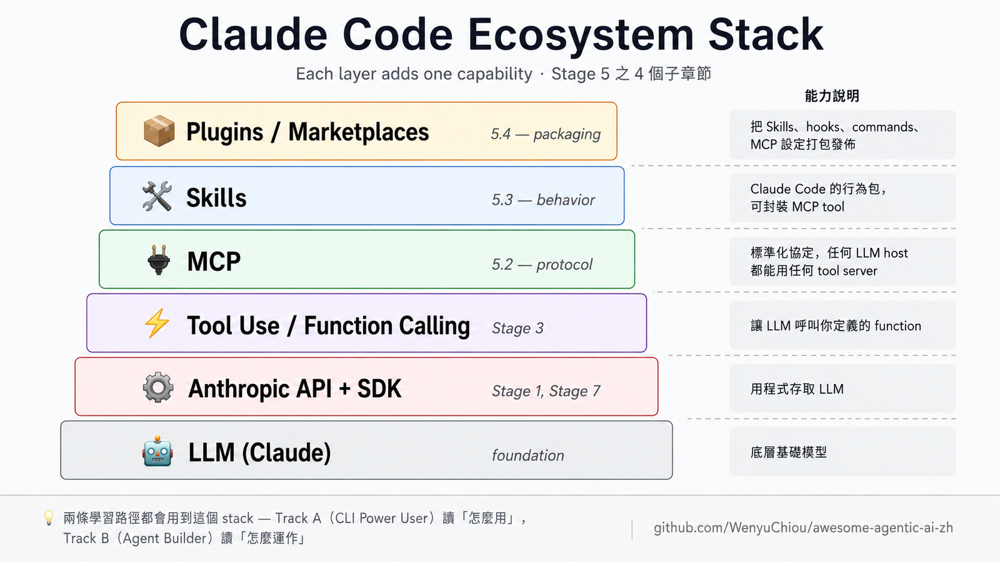

# Stage 5 — Claude Code 生態系 ⭐⭐

> **繁體中文** | [简体中文](./05-claude-code-ecosystem.zh-Hans.md) | [English](./05-claude-code-ecosystem.en.md)

⏱ **時間估算**：3-4 週（約 15-25 小時）

> 💡 整個 stage 圍繞 4 個關鍵詞（**MCP / Skills / Plugins / Marketplace**）展開 → 不熟先翻 [`resources/glossary.md` §5](../resources/glossary.md#5-claude-code-生態)。

> 📌 **這個 stage 兩條軌都用**：
> - **Track A（CLI Power User）**：A2 用 [5.1（Claude Code 基礎）](#51--claude-code-基礎)；A3 用 [5.2（MCP）](#52--mcpmodel-context-protocol-基礎) + 選擇性用到 [5.3（Skills）](#53--skillsclaude-code-的行為層) 跟 [5.4（Plugins）](#54--plugins-與-marketplaces)（A3 的 動手練習 CLI-12 會教把 CLAUDE.md 跟 commands 打包成 plugin）。讀的角度是「**怎麼用 Claude Code 把工作做好**」
> - **Track B（Agent Builder）**：把整個 stage 當「**Claude Code 內部怎麼運作**」的深度學習，從 5.1 完整走到 5.4

> 🗺️ **Claude Code 屬於哪種 agent 型態**？→ [`resources/agent-paradigms.md`](../resources/agent-paradigms.md) §Type 1（IDE-coupled）+ §Type 2（Terminal pair-programmer）；想看完整 5 種 paradigm 對照也從這份開始。

> ⚠️ **想用本機 LLM？這個 stage 不是那條路線。** Claude Code 需要 Anthropic API / OAuth，不能直接改接 Ollama 或本機 endpoint。離線、隱私資料或不想用 API 額度時，請看 [`resources/cookbook.md` Recipe 6](../resources/cookbook.md#6-本機-llm--cli-agent-快速-walkthrough)，用 OpenCode / goose / Aider / Hermes 這類支援 BYO LLM 的 CLI agent。

> 📋 **本章組成**：6 個子章（5.1 基礎 / 5.2 MCP / 5.3 Skills / 5.4 Plugins / 5.5 Subagents / 5.6 Harness Internals），每個子章都有「學習目標 → 必修閱讀 → 動手練習 → 精選 Projects」 → 章末 自我檢查  
> 🔑 **關鍵名詞**：見 [`resources/glossary.md` §5](../resources/glossary.md#5-claude-code-生態)

## Stack 一覽

由上往下，每一層都建立在底下那一層上：



每一層各自加上一種能力：
- **API + SDK**：用程式存取 LLM
- **Tool Use**：讓 LLM 呼叫你定義的 function
- **MCP**：標準化協定，讓任何 LLM host 都能使用任何 tool server
- **Skills**：Claude Code 的行為包，可以封裝 MCP tool
- **Plugins**：把 Skills、hooks、commands、MCP 設定打包成一個單位發佈

這個階段有 4 個子章節，**請按順序做**——每一節都建立在前一節之上。

```
5.1  Claude Code 基礎          3-5 天   （安裝、slash commands、CLAUDE.md）
5.2  MCP — 協定層              5-7 天   （寫你的第一個 MCP server）
5.3  Skills — 行為層            5-7 天   （寫你的第一個 SKILL.md）
5.4  Plugins 與 Marketplaces   5-7 天   （打包並發佈）
```

跑完這個階段，你會能擴充 Claude Code、寫自己的 MCP server、發佈一個 plugin marketplace。

---

## 5.1 — Claude Code 基礎

### 學習目標
- 在你的作業系統上安裝 Claude Code
- 使用 slash commands（`/help`、`/compact`、`/clear`、`/plan`）
- 了解 `~/.claude/` 目錄結構
- 寫一份 project 層級的 `CLAUDE.md` 來客製化行為

### 必修閱讀
1. [**Anthropic — Claude Code Quickstart**](https://docs.anthropic.com/en/docs/claude-code/quickstart) — 官方安裝指南
2. [**Anthropic — CLAUDE.md best practices**](https://docs.anthropic.com/en/docs/claude-code/memory) — 怎麼寫專案 memory
3. [**KimYx0207/Claude-Code-x-OpenClaw-Guide-Zh**](https://github.com/KimYx0207/Claude-Code-x-OpenClaw-Guide-Zh) — 簡中入門指南

### 動手練習
- **練習：Claude Code** — 安裝、跑第一個 session、請 Claude 讀檔案並摘要
- **練習：CLAUDE.md** — 寫一份專案 CLAUDE.md，觀察行為的差異

### 精選 Projects
- [**anthropics/claude-code**](https://github.com/anthropics/claude-code) — 官方 repo（issues、releases）
- [**KimYx0207/Claude-Code-x-OpenClaw-Guide-Zh**](https://github.com/KimYx0207/Claude-Code-x-OpenClaw-Guide-Zh) — 簡中導讀
- [**hesreallyhim/awesome-claude-code**](https://github.com/hesreallyhim/awesome-claude-code) — 較廣泛的資源清單（目前正在重整）

---

## 5.2 — MCP（Model Context Protocol）⭐ 基礎

### 學習目標
- 解釋 MCP 的三個抽象（Tools、Resources、Prompts）
- 把現成的 MCP server 接上 Claude Desktop 或 Claude Code
- 用 Python 寫一個最小的 MCP server，提供 1-2 個 tool
- 區分 MCP server vs Tool Use vs Skills vs Plugins

### 必修閱讀
1. [**Anthropic — Introducing MCP**](https://www.anthropic.com/news/model-context-protocol) — 最初發表，概念總覽
2. [**MCP Specification**](https://modelcontextprotocol.io/specification) — 實際的協定規格
3. [**Complete Guide to MCP in 2026**](https://dev.to/x4nent/complete-guide-to-mcp-model-context-protocol-in-2026-architecture-implementation-and-4a11) — 實作導讀

### 動手練習
- **練習：MCP client** — 安裝 `modelcontextprotocol/servers/filesystem`，從 Claude Desktop 連上去。看著 Claude 讀你的檔案。
- **練習：MCP server** — 寫一個 Python MCP server，提供一個 tool（例如「換算溫度」）。從 Claude Code 連過去。**step-by-step 怎麼做** → [`resources/cookbook.md` §2](../resources/cookbook.md#2-寫你的第一個-mcp-server)
- **練習：MCP in production** — 在同一個 Claude session 裡同時連 2-3 個 MCP server，看它們互相搭配。

### 精選 Projects

> 💡 **找日常工具的 MCP（Notion / Obsidian / Excel / Postgres / Playwright / Figma 等）？**
> 看 [`resources/mcp-skills-catalog.md`](../resources/mcp-skills-catalog.md)——按 14 個分類整理 62 個常用 MCP server / Skill，每個都附 stars / license / 適合誰。下面這節保留的是「**寫自己 MCP server 時的 reference**」性質的官方 server / SDK。


#### [modelcontextprotocol/servers](https://github.com/modelcontextprotocol/servers) ⭐ 官方

| 欄位 | 內容 |
|---|---|
| 語言 | TypeScript / Python |
| Stars | ★ 85k+ |
| License | MIT |
| 推薦度 | ⭐⭐⭐⭐⭐ |

**教什麼**：20+ 個參考用 MCP server（filesystem、git、github、sqlite、time、fetch、memory、sequential thinking）。寫自己的 server 時最標準的範例。

**適合誰**：練習 1 以及之後當參考用。讀 `everything` server 跟 `filesystem` server 的原始碼，理解協定怎麼運作。

**怎麼跑**：
```bash
npx -y @modelcontextprotocol/server-filesystem /path/to/dir
# 或用 Python servers：
pip install mcp-server-fetch
```

---

#### [modelcontextprotocol/python-sdk](https://github.com/modelcontextprotocol/python-sdk)

| 欄位 | 內容 |
|---|---|
| 語言 | Python |
| License | MIT |
| 推薦度 | ⭐⭐⭐⭐⭐ |

**教什麼**：寫 MCP server 的官方 Python SDK。練習 2 用這個。

**怎麼跑**：
```bash
pip install mcp
# 然後跟著 https://github.com/modelcontextprotocol/python-sdk#quickstart 做
```

---

#### [modelcontextprotocol/typescript-sdk](https://github.com/modelcontextprotocol/typescript-sdk)

| 欄位 | 內容 |
|---|---|
| 語言 | TypeScript |
| License | MIT |
| 推薦度 | ⭐⭐⭐⭐ |

**教什麼**：Python SDK 的 TypeScript 版本。喜歡 TS 的人選這個。

---

#### [wong2/awesome-mcp-servers](https://github.com/wong2/awesome-mcp-servers) ⭐ 目錄

| 欄位 | 內容 |
|---|---|
| 形式 | 精選清單 |
| 推薦度 | ⭐⭐⭐⭐⭐ |

**教什麼**：150+ 個社群 MCP server 的目錄，按類別分類——search、code、cloud、communication、finance。

**適合誰**：在自己寫之前，先看看是不是已經有現成的。有特定 tool 需求時來逛這個。

**備註**：投稿要走他們網站（mcpservers.org）。

---

#### [punkpeye/awesome-mcp-servers](https://github.com/punkpeye/awesome-mcp-servers)

| 欄位 | 內容 |
|---|---|
| 推薦度 | ⭐⭐⭐⭐ |

**教什麼**：另一份 MCP server 目錄，組織方式不同（通常更新比較即時）。

**適合誰**：跟 wong2 的清單交叉比對。不同策展人會挖出不同的 project。

---

#### [github/github-mcp-server](https://github.com/github/github-mcp-server)

| 欄位 | 內容 |
|---|---|
| 推薦度 | ⭐⭐⭐⭐ |

**教什麼**：真正在 production 跑的 MCP server 長什麼樣子。GitHub 官方維護。

**適合誰**：把原始碼當作 production 等級 MCP server 的參考實作來讀。

---

#### [21st-dev/magic-mcp](https://github.com/21st-dev/magic-mcp)

| 欄位 | 內容 |
|---|---|
| Stars | ★ 4.8k+ |
| License | NOASSERTION |
| 推薦度 | ⭐⭐⭐ |

**教什麼**：一個非平凡的 MCP server，會生成 UI 元件。讓你看到 MCP 不只能做資料抓取。

**適合誰**：做完 練習 2 之後找靈感——MCP server 還能做出什麼有創意的東西。

---

## 5.3 — Skills（Claude Code 的行為層）

### 學習目標
- `SKILL.md` 的結構（YAML frontmatter + 本文）
- skill 何時會自動載入（description 比對）
- 怎麼寫一份能解決你日常工作的 SKILL.md
- `references/`、`scripts/`、`evals/` 子目錄的用途

### 必修閱讀
1. [**Anthropic — Claude Skills 文件**](https://docs.anthropic.com/en/docs/claude-code/skills)
2. **幾份範例 SKILL.md**——從 `anthropics/claude-code` 或社群 marketplace 拿
3. [**Hello-Agents — Extra08 如何寫出好的 Skill**](https://github.com/datawhalechina/hello-agents/blob/main/Extra-Chapter/Extra08-如何写出好的Skill.md) — 中文最完整的 Skill 最佳實踐
4. [**Hello-Agents — Extra05 Agent Skills 與 MCP 對比解讀**](https://github.com/datawhalechina/hello-agents/blob/main/Extra-Chapter/Extra05-AgentSkills解读.md) — Skills vs MCP 概念對比

### 動手練習
- **練習：SKILL.md** — 寫一份 200 字的 skill，解決你日常工作中的某一件事。**step-by-step 怎麼做** → [`resources/cookbook.md` §1](../resources/cookbook.md#1-寫你的第一個-skill)
- **練習：SKILL with references** — 加一份 `references/` markdown 讓 skill 可以引用
- **練習：SKILL eval** — 加 `evals/evals.json`，放 3-5 個自我測試

> 📦 **本 repo 自帶 meta-example**：[`examples/stage-5/tool-calling-tutor/`](../examples/stage-5/tool-calling-tutor/) 是這個 stage 的對應 skill 範本——完整 frontmatter（含 trigger phrases + Do NOT use for）、3 份 `references/`、`evals/evals.json` 5 個 test case，**直接 fork 改成你自己的 skill**。雙重用途：(a) 學習者自用、卡在 tool calling 時讓它 auto-load 幫你 debug；(b) Stage 5 §5.3 SKILL.md 寫法的對照樣板。

### 精選 Projects

> 💡 **找日常用 Skill（NotebookLM、Excalidraw、Office docs 等）？**
> 看 [`resources/mcp-skills-catalog.md`](../resources/mcp-skills-catalog.md)——按使用情境分類，含 Anthropic 官方 + 社群 Skill。下面這節保留的是「**寫自己 Skill 時的 reference**」性質的 spec / showcase。

#### [anthropics/skills](https://github.com/anthropics/skills) ⭐ 官方 spec

| 欄位 | 內容 |
|---|---|
| Stars | ★ 128k+ |
| License | NOASSERTION |
| 推薦度 | ⭐⭐⭐⭐⭐ |

**教什麼**：Anthropic 官方的 Skills repo——`spec/`（SKILL.md frontmatter 標準）+ `template/`（起手範本）+ `skills/`（pdf、docx、xlsx、pptx、skill-creator 等 reference 實作）。

**適合誰**：寫自己的 SKILL.md 之前先讀這個——SKILL.md 結構與 frontmatter 的重要參考實作。

**備註**：跟 `anthropics/claude-code` 不一樣——這個是專門的 Skills repo，後者是 Claude Code 的主 repo。Agent Skills 的更廣義標準另見 [agentskills.io](https://agentskills.io)。

---

#### [anthropics/claude-code](https://github.com/anthropics/claude-code)

| 欄位 | 內容 |
|---|---|
| 推薦度 | ⭐⭐⭐⭐ |

**教什麼**：Claude Code 主 repo，內含 issues、releases 與一些 inline skill 範例。

**適合誰**：追蹤新版功能、回報 bug、看 release notes。

**備註**：在這個 stage（學 Skills），這個 repo 排在 `anthropics/skills`（⭐⭐⭐⭐⭐ 官方 spec）後面，所以給 ⭐⭐⭐⭐。在 branches（給 end-user 當入口）裡會看到 ⭐⭐⭐⭐⭐ 評等，是因為角色不同。

---

#### [travisvn/awesome-claude-skills](https://github.com/travisvn/awesome-claude-skills)

| 欄位 | 內容 |
|---|---|
| 推薦度 | ⭐⭐⭐⭐ |

**教什麼**：社群 Claude Skills 的精選目錄。

**適合誰**：自己寫之前先看看有沒有現成的。

---

#### [obra/superpowers](https://github.com/obra/superpowers)

| 欄位 | 內容 |
|---|---|
| 推薦度 | ⭐⭐⭐⭐ |

**教什麼**：20+ 個經過實戰檢驗的 skill（TDD、debugging、合作模式），附 `/brainstorm`、`/write-plan`、`/execute-plan` 命令以及 skills-search tool。

**適合誰**：power user 的設定。讀 SKILL.md 原始碼學進階寫法。

---

#### [VoltAgent/awesome-agent-skills](https://github.com/VoltAgent/awesome-agent-skills)

| 欄位 | 內容 |
|---|---|
| Stars | ★ 20k+ |
| License | MIT |
| 推薦度 | ⭐⭐⭐ |

**教什麼**：1000+ 個 agent skill，相容於 Claude Code、Codex、Gemini CLI、Cursor。跨工具的視角。

**適合誰**：搞懂 SKILL.md 之後，逛逛找想法。

---

#### [alirezarezvani/claude-skills](https://github.com/alirezarezvani/claude-skills)

| 欄位 | 內容 |
|---|---|
| 推薦度 | ⭐⭐⭐ |

**教什麼**：232+ 個 Claude Code skill，跨 engineering、marketing、product、compliance。

**適合誰**：找特定領域的 skill 範例。

---

#### [mattpocock/skills](https://github.com/mattpocock/skills)

| 欄位 | 內容 |
|---|---|
| Stars | ★ 61k+ |
| License | MIT |
| 推薦度 | ⭐⭐⭐⭐ |

**教什麼**：Matt Pocock（TypeScript 社群知名教學者）公開自己工作中真實在用的 `.claude/` 目錄。每個 SKILL.md 都很短（10-50 行），不過度工程化。

**適合誰**：想看「真實工程師日常用的 SKILL.md 長什麼樣子」的人。對照那些動輒 200 行的 over-engineered skill，這份特別有參考價值。

---

#### [wshobson/agents](https://github.com/wshobson/agents)

| 欄位 | 內容 |
|---|---|
| Stars | ★ 35k+ |
| License | MIT |
| 推薦度 | ⭐⭐⭐⭐ |

**教什麼**：把 skills + subagents 組合起來做 multi-agent 編排。**從單一 SKILL.md 進化到 agent-as-skill 組合 pattern** 的範例。

**適合誰**：跑過幾個 SKILL.md 之後，想知道「skill 之間怎麼互相呼叫、怎麼變成更大的 agent workflow」的中階學習者。

---

## 5.4 — Plugins 與 Marketplaces

### 學習目標
- `plugin.json` schema（name、version、skills array、configuration）
- `marketplace.json` schema（plugins array、source、metadata）
- `claude plugin marketplace add` 的流程
- 區分 single-plugin bundle vs multi-plugin marketplace
- 發佈自己的 marketplace

### 必修閱讀
1. [**Anthropic — Plugins 文件**](https://docs.anthropic.com/en/docs/claude-code/plugins)
2. **讀下面 2-3 個 marketplace 的 `plugin.json` 與 `marketplace.json`**

### 動手練習
- **練習：plugin install** — 安裝下面的某一個 marketplace，看它載入
- **練習：plugin.json** — 把 5.3 寫的 SKILL.md 打包成一個 plugin
- **練習：marketplace publish** — push 到 GitHub，用 `claude plugin marketplace add` 安裝

### 精選 Projects

> 💡 **想看別人的 plugin 怎麼包**：[`resources/mcp-skills-catalog.md`](../resources/mcp-skills-catalog.md) 的開發協作 / 設計 / 監控分類底下不少都附 plugin 包裝（例如 `timescale/pg-aiguide` 同時是 MCP 跟 plugin）。下面這節保留的是「**marketplace 結構範本**」性質的 reference。

#### [anthropics/claude-plugins-official](https://github.com/anthropics/claude-plugins-official) ⭐ 官方

| 欄位 | 內容 |
|---|---|
| Stars | ★ 18k+ |
| License | NOASSERTION（每個 plugin 獨立 license，請看各自目錄） |
| 推薦度 | ⭐⭐⭐⭐⭐ |

**教什麼**：Anthropic 官方的 marketplace 範本——`.claude-plugin/marketplace.json` 標準 schema、`plugins/` 內含 plugin 本體、`external_plugins/` 引用外部 repo 的 plugin。

**適合誰**：寫自己的 marketplace 之前，這是最該對著抄的官方範本——「**marketplace.json 該長什麼樣**」直接看這個。

**備註**：除了 schema 之外，也是觀察 Anthropic 怎麼分類官方 plugin（chrome-devtools、deepwiki、code-research、jam 等）的好參考。

---

#### [obra/superpowers-marketplace](https://github.com/obra/superpowers-marketplace)

| 欄位 | 內容 |
|---|---|
| Stars | ★ 900+ |
| License | MIT |
| 推薦度 | ⭐⭐⭐⭐ |

**教什麼**：**最簡 marketplace template**——repo 裡只有 `.claude-plugin/marketplace.json` + README，plugin 本體放在外部 repo。展示「**curator-only marketplace**」（策展者只負責挑選、不打包原始碼）的最小形式。

**適合誰**：要做「我策展、別人寫」型 marketplace 的人。比 anthropics/claude-plugins-official 更精簡，是最小可行範本。

---

#### [trailofbits/skills-curated](https://github.com/trailofbits/skills-curated)

| 欄位 | 內容 |
|---|---|
| Stars | ★ 388 |
| License | CC-BY-SA-4.0 |
| 推薦度 | ⭐⭐⭐ |

**教什麼**：知名資安公司 Trail of Bits 維護的 curated marketplace，重點在 **supply-chain security**——每個 skill 都經過審查，README 寫清楚審核標準。

**適合誰**：在意供應鏈信任、想學「**curator-vouches-for-safety**」這種模式的 reviewer 跟團隊。

**備註**：規模小但意義大——示範 marketplace 不只是 skill 的清單，也可以是信任機制。

---

#### [rohitg00/awesome-claude-code-toolkit](https://github.com/rohitg00/awesome-claude-code-toolkit)

| 欄位 | 內容 |
|---|---|
| 推薦度 | ⭐⭐⭐ |

**教什麼**：社群中規模最大的 Claude Code agents、skills、hooks、templates 目錄之一。涵蓋的 use case 很廣。

**適合誰**：跑完 練習 3 之後逛逛看外面有什麼。

---

#### [anthropics/life-sciences](https://github.com/anthropics/life-sciences)（領域特化範例）

| 欄位 | 內容 |
|---|---|
| Stars | ★ 331 |
| License | NOASSERTION（marketplace 本身未提供 SPDX；裡面每個 MCP server 由各自 provider 授權） |
| 推薦度 | ⭐⭐⭐ |

**教什麼**：Anthropic 自己發的**領域特化 marketplace** 範例（針對生物 / 健康科學）——展示如何把 `marketplace.json` 為單一 vertical 量身設計，而不是塞通用清單。

**適合誰**：要做特定領域 marketplace（醫療、金融、法律、教育等）的人，可以參考 Anthropic 自己怎麼處理。

**備註**：payload 偏生科 MCP server，但 marketplace.json 結構本身才是學習重點。

---

> **「如何發佈自己的 marketplace」教學還缺**——目前最可靠的是 [Anthropic 官方 plugin 文件](https://docs.claude.com/en/docs/claude-code/plugins)。社群有寫過好的 walkthrough 部落格 / repo？歡迎開 PR 補上。

---

## 5.5 — Subagents（Claude Code 原生 multi-agent 機制）⭐ 2025 新功能

到這裡為止你學了 MCP（工具層）/ Skills（行為層）/ Plugins（散佈層）。**Subagents 是 orchestration 層**——讓主 Claude session spawn 出有獨立 context 的子 agent、跑特定任務、回報結果。

跟 Stage 4 的 framework-based multi-agent（LangGraph / CrewAI / AutoGen）對照：

| 維度 | Framework path (Stage 4) | Claude Subagent path（本節） |
|---|---|---|
| 啟動方式 | `pip install crewai` + Python code | 寫一個 `.claude/agents/<name>.md` 即可 |
| Runtime | 你自己的 Python process | Claude Code 內建 Task tool |
| Context isolation | framework 自己管 | **天生** 各 subagent 獨立 window |
| Provider lock-in | 中等（多 framework 支援 multi-LLM） | **強**（綁 Claude Code） |
| 適合 | 跨 LLM provider 的 production system | 已 commit Claude Code 的工程團隊 |
| 學習曲線 | 高（框架抽象 + async） | 低（寫 markdown）|

### 學習目標

- 講得出 subagent 跟 skill / MCP server 的差別（**subagent ≠ skill**：skill 是行為 prompt，subagent 是**另一個 Claude instance with isolated context**）
- 寫一個 `.claude/agents/<name>.md` 自訂 subagent（frontmatter + system prompt + tool whitelist）
- 從主 session 用 Task tool invoke subagent，觀察 context 隔離（parent 看不到 subagent 的中間 step、只看到最終 result）
- 知道何時用 subagent（parallel research / large-context isolated task / specialized review），何時不用（小 query 用 skill 即可）

### 必修閱讀

1. [**Anthropic — Claude Code Subagents 官方文件**](https://docs.claude.com/en/docs/claude-code/sub-agents) ⭐ — `.claude/agents/` 結構、Task tool 介面、最佳實踐
2. [**Anthropic — Building Effective Agents §orchestrator-workers**](https://www.anthropic.com/engineering/building-effective-agents) — Anthropic 自己對 orchestrator pattern 的看法（理論 + 實例）
3. [**Anthropic Cookbook — customer_service_agent**](https://github.com/anthropics/anthropic-cookbook/tree/main/multimodal) — canonical multi-agent orchestration 範例（chapter-length 深度教材）

### 動手練習

- **練習：第一個 subagent** — 寫 `.claude/agents/code-reviewer.md`（前置 frontmatter 含 `description` 寫清楚何時 trigger、`tools` 限定 Read+Grep）+ system prompt 跑 staged diff review。從主 Claude session 跑 `/agents` list 確認載入、然後用 prompt「review staged changes」觀察 Task tool 怎麼 spawn subagent
- **練習：parallel subagent crew** — 寫 3 個 subagent（`researcher.md` / `writer.md` / `critic.md`）做「研究某主題 → 寫 blog 草稿 → 審稿」pipeline、主 session 用 Task tool 串起來。**對照** [`examples/stage-4/02-multi-agent-roles/`](../examples/stage-4/02-multi-agent-roles/)（CrewAI 框架版同一個任務）、看「framework 路線 vs Claude 原生路線」程式碼差別
- **練習：subagent 跟 skill 的決策練習** — 拿你自己日常工作流的 5 個常用任務、每個判斷該用 skill（行為層）還是 subagent（獨立 context 層）。寫成 1 頁 decision table

> 📚 **想要 chapter-length 深入版**：subagent 進階 pattern（agent-as-skill composition、parallel-spawn、handoff between subagents）→ 看 [`wshobson/agents`](https://github.com/wshobson/agents) repo 整個結構 + [`obra/superpowers`](https://github.com/obra/superpowers) 的 subagent 用法。

### 精選 Projects

#### [anthropics/anthropic-cookbook](https://github.com/anthropics/anthropic-cookbook) ⭐ 官方 canonical reference

| 欄位 | 內容 |
|---|---|
| 語言 | Python（Jupyter notebook） |
| License | MIT |
| 推薦度 | ⭐⭐⭐⭐⭐ |

**教什麼**：Anthropic 官方多個 chapter-length multi-agent 範例。**`customer_service_agent`** 是 orchestrator-workers pattern 的 canonical reference；**`computer_use_demo`** 示範 Claude 操作螢幕的多 agent setup。

**適合誰**：所有 Stage 5.5 完成後想看「production-grade 怎麼長」的人。本 stage 練習是 illustrative、cookbook 是 production reference。

---

#### [wshobson/agents](https://github.com/wshobson/agents) ⭐ subagent pattern canonical

**教什麼**：把 subagent 跟 skill 組合成 production workflow 的 pattern collection。看 `.claude/agents/` 目錄結構、命名 convention、跨 agent handoff 寫法。

**適合誰**：寫過自己 1-2 個 subagent 之後、想看「真實 team 怎麼用」的範本。

---

#### [obra/superpowers](https://github.com/obra/superpowers) ⭐ subagent + skill 整合 production

**教什麼**：（在 Stage 5.3 已介紹）整套 production-ready skill collection。看裡面**怎麼把 skill 跟 subagent 混搭**——什麼任務歸 skill（行為 prompt）、什麼歸 subagent（獨立 context）。

---

#### [Anthropic Claude Code 官方 plugins 範本](https://github.com/anthropics/claude-plugins-official)

**教什麼**：（在 Stage 5.4 已介紹）官方 plugin marketplace。**注意每個 plugin 是怎麼把 subagent + skill + slash command 打包**——subagent definition 通常在 `agents/` 子目錄裡。

---

> 💡 **Subagent 雖然強、不要無腦用**：每個 subagent invoke 都是一個新的 Claude inference call、有 token cost + latency。**簡單 query 用 skill（行為 prompt）即可、不必 spawn subagent**。Subagent 的甜蜜點是：(1) 任務 context 大、會吃光主 session 的 window（譬如 read 整個 codebase），(2) 任務跟主 session 邏輯獨立、隔離 context 有助 main flow，(3) 多 subagent 平行（research / write / critic）能省 wall-clock 時間。

---

## 5.6 — Harness Internals（agent runtime 的內部結構）⭐ Track B 必看

到 5.5 為止你會**用** Subagent 了，但**沒看過 Claude Code 內部到底怎麼跑 agent loop**。本節打開引擎蓋——這節是 Track B（Agent Builder）的高潮章節：production agent 不是「LLM + tool」那麼簡單，中間還有一整套 runtime 層處理 dispatch / context / safety / retry / telemetry。

### 學習目標

完成本節後你會：
- 講得出「agent harness 由哪些部分組成」（loop / tool registry / context manager / safety layer / telemetry）並對應到 Claude Code 哪裡
- 看得懂 `claude-agent-sdk-python` source 的 main loop（不是逐行、是抓得到主幹）
- 講得清楚 **framework（Stage 4）vs harness 差在哪**：framework 規範 **API**（你呼叫的介面），harness 規範 **runtime**（怎麼跑、怎麼 recovery、怎麼觀測）

### 為什麼這節在這裡（不在 Stage 4 / Stage 7）

- **Stage 4** 教你「用」framework（LangGraph / CrewAI etc.）——抽象層之上的視角
- **Stage 7** 教你 production 的 eval / observability / deploy——抽象層之下的視角
- **本節** 在中間：framework 之下、deploy 之上，**runtime 內部解剖**。Claude Code 本身就是一個高完成度的 reference harness，所以放在 Stage 5

### 📚 必修閱讀

1. [**Anthropic — Building Effective Agents**](https://www.anthropic.com/research/building-effective-agents) ⭐ — orchestrator / worker / handoff / reflection 等 pattern 的 canonical reference
2. [**anthropics/claude-agent-sdk-python**](https://github.com/anthropics/claude-agent-sdk-python) — Claude Code 官方 Python SDK 的 source；**重點 file：`src/claude_agent_sdk/_internal/client.py`**（main loop 在這）+ `query.py`（單回合 API）
3. [**ai-boost/awesome-harness-engineering**](https://github.com/ai-boost/awesome-harness-engineering) ⭐（★ 780+） — community curation：harness pattern / eval / memory / observability 整合
4. [**ZhangHanDong/harness-engineering-from-cc-to-ai-coding**](https://github.com/ZhangHanDong/harness-engineering-from-cc-to-ai-coding) — 中文圈最完整的 Claude Code 內部解讀

### 🛠 動手練習 — 解剖 agent loop（閱讀題，非寫 code）

這節**不是寫 code 練習，是閱讀練習**——production harness 不是抄 200 行範例能學的，是抄完還看不懂為什麼這樣寫，所以本練習要求你開 source、自己 trace。

**步驟**：
1. **clone**：`git clone https://github.com/anthropics/claude-agent-sdk-python`
2. **定位 agent loop**：找出 `_internal/client.py` 裡實際發出 LLM call、收 tool_use response、dispatch 給 tool runner 的核心 loop。提示：找 `async def` 跟 `tool_use_id` 關鍵字
3. **標出 5 個關鍵元件**在 source 裡的位置（檔名 + 行號）：
   - (a) **Tool call dispatch**：LLM 回 tool_use → 怎麼 route 到對應 tool 實作
   - (b) **Context append**：tool result 怎麼寫回 message history、變成下一輪的 input
   - (c) **Safety check**：tool 執行前有沒有 permission gate / sandboxing
   - (d) **Retry / error path**：tool fail 時怎麼處理（直接拋 exception 還是 LLM 自己看 error 反思）
   - (e) **Telemetry hook**：metrics / logging / token counting 接在哪
4. **寫一段 80-150 字摘要**：「Claude Code 的 agent loop 跟你 Stage 3 練習 3 from-scratch ReAct 差在哪」。重點不是「Claude Code 比較複雜」這種廢話，是**講得出多了哪些東西、為什麼那些是 production-grade 必須**

**交付物**：一段筆記（寫在自己的 obsidian / notion / `.md` 都行），不必交。但**講不出來你就還沒懂**——這是進 Stage 7 production deploy 之前的必要 mental model。

→ **基礎 starter 範本**：本練習**無 examples folder**——是 source-reading exercise，非 code-writing exercise。illustrative，深度教學見上方 📚。

### 🎯 精選 Projects

#### [anthropics/claude-agent-sdk-python](https://github.com/anthropics/claude-agent-sdk-python) ⭐⭐⭐⭐⭐

**適合誰**：所有 Track B 學習者、想搞清楚「Claude Code 內部怎麼跑」的工程師。

**教什麼**：canonical Python harness。本練習就是讀這個 repo。也是後面 Stage 7 deploy 時你會 import 的 SDK。

---

#### [ZhangHanDong/harness-engineering-from-cc-to-ai-coding](https://github.com/ZhangHanDong/harness-engineering-from-cc-to-ai-coding) ⭐⭐⭐⭐

**適合誰**：中文 reader 想看「為什麼 Claude Code 這樣設計」的高層 narrative，配合上面 SDK source 一起讀。

**教什麼**：中文圈最完整的 Claude Code 內部解讀，從 harness 概念 → CC 實作 → 跟其他 AI coding tool 的對比都有。**配合 SDK source 看，互補**——一個告訴你「怎麼做」、一個告訴你「為什麼這麼做」。

---

#### [ai-boost/awesome-harness-engineering](https://github.com/ai-boost/awesome-harness-engineering) ⭐⭐⭐⭐

**適合誰**：Stage 5.6 讀完想擴大視野的人。

**教什麼**：community curation：30+ harness / eval / memory / observability / MCP 相關 project。**廣度資源庫，不是教程**——挑你感興趣的 sub-topic 鑽進去。

---

#### [wshobson/agents](https://github.com/wshobson/agents)（在 5.5 已介紹、本節 cross-ref）

**適合誰**：寫完 §5.5 自己的 subagent 後想看更多 production-grade subagent 設計範本的人。

**教什麼**：50+ 個 subagent definition 的 ergonomic 設計 — 包括 description 怎麼寫、tool list 怎麼選、system prompt 怎麼分層。**讀 source 比讀文件學得多**——本節練習做完應該已經有能力看懂為什麼某個 subagent 這樣寫。

---

> 💡 **本節跟 Stage 7 的差別**：本節學「Claude Code 這個 harness 怎麼跑」（具體 reference）；Stage 7 學「production harness 一般要有什麼」（抽象 pattern）。先具體後抽象，看完本節再進 Stage 7 會輕鬆很多。

---

## ✅ 進入 Stage 6 前的自我檢查

你能不能：
- [ ] 安裝 Claude Code 並使用 5 個不同的 slash command
- [ ] 在同一個 Claude session 裡接 2 個 MCP server
- [ ] 用 Python 寫自己的 MCP server，提供 1 個能用的 tool
- [ ] 寫一份能在特定觸發詞自動載入的 `SKILL.md`
- [ ] 把 skill 打包成 plugin，再用 `marketplace.json` 發佈
- [ ] **寫過 `.claude/agents/` 自訂 subagent 並從 Task tool invoke 過**
- [ ] **讀過 `claude-agent-sdk-python` 的 main loop、能講出 5 個關鍵元件位置**（§5.6 練習）
- [ ] 從角色分工說出 MCP / Skills / Plugins / Subagents / SDK 各自的位置

如果都可以 → 前往 [Stage 6 — Memory & RAG](06-memory-rag.md)。

## 💡 Bonus：完成這個階段之後

- 對 [`anthropics/claude-cookbooks`](https://github.com/anthropics/claude-cookbooks) 發一個 PR（小修正、文件更新）
- 把自己的 plugin 投稿到社群 marketplace
- 寫一篇文章，比較自己的 hello-MCP server 跟官方 `modelcontextprotocol/servers` 收的某一個
